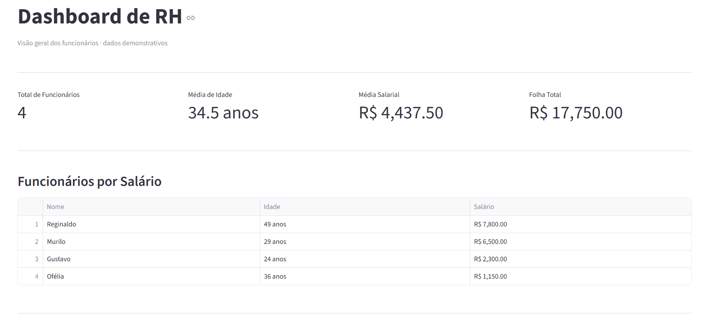
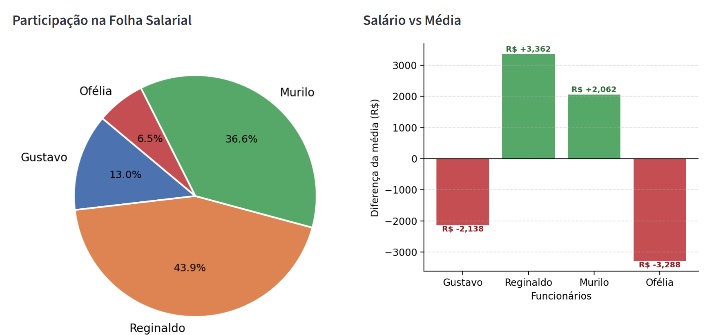

# 📊 Dashboard de Insights de RH

Este projeto foi desenvolvido para demonstrar a criação de um sistema de análise de dados utilizando Python, Streamlit, Pandas e Matplotlib, integrado a uma API Backend customizada.  

O dashboard apresenta indicadores importantes de Recursos Humanos (RH), permitindo a visualização de métricas estratégicas de funcionários por meio de gráficos e tabelas interativas.

---

## 🚀 Funcionalidades

- 📈 Visualização de métricas de RH
- 👥 Quantidade total de funcionários
- 💰 Média salarial
- 📊 Folha de pagamento total
- 🎂 Média de idade
- 📉 Gráficos de salário e idade
- 📋 Tabela detalhada dos funcionários
- 🔗 Integração com API Backend
- 🌐 Sistema publicado online com domínio ativo

---

## 🖼️ Preview do Sistema

## Dashboard Principal



## Gráficos Analíticos



---

## 🛠️ Tecnologias Utilizadas

### Frontend
- Python
- Streamlit
- Pandas
- Matplotlib

### Backend
- FastAPI
- Node.js

### Infraestrutura
- Replit

---

## 📂 Estrutura do Projeto

```bash
📦 dashboard-rh
 ┣ 📂 imagens
 ┃ ┣ 📜 dashboard-analitico.png
 ┃ ┗ 📜 dashboard-metricas.png
 ┣ 📜 main.py
 ┣ 📜 README.md

